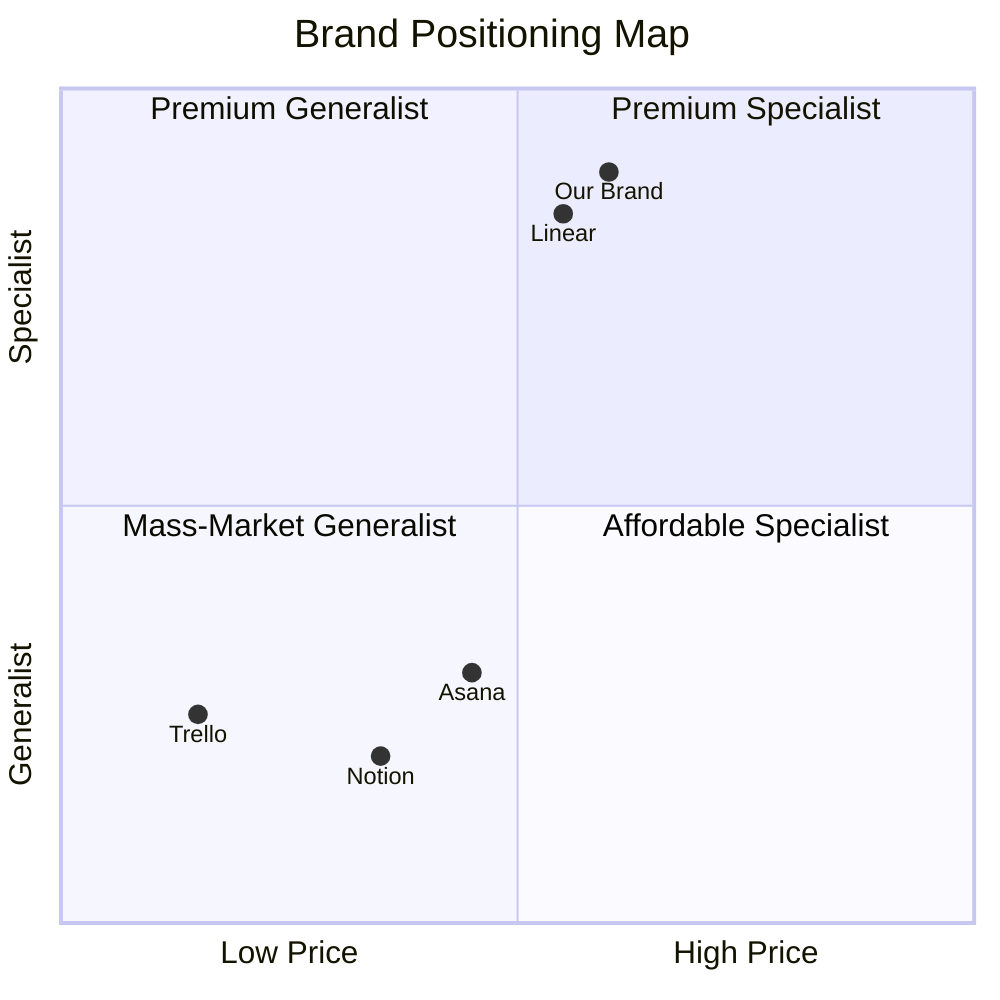

# Competitor Analysis — Reference

Supplementary reference material for the `competitor-analysis` skill. Covers positioning frameworks, dimension libraries, evidence-quality rubrics, and the white-space defensibility test.

---

## 1. Positioning Frameworks

### 1.1 Trout & Ries — Positioning

The original positioning theory. Key ideas:

- A position lives in the customer's mind, not in the marketer's plan
- The mind has limited shelf space — typically 7±2 brands per category
- The first brand to occupy a position has a near-permanent advantage
- A brand cannot be repositioned in the customer's mind through advertising alone — it requires changing what the brand actually does

**Practical implication:** If a competitor already owns "fastest", "cheapest", or "most premium" in the customer's mind, attacking that position head-on is expensive and usually unsuccessful. Find an unowned position.

### 1.2 Blue Ocean Strategy

Move from "red oceans" (saturated competition on the same dimensions) to "blue oceans" (uncontested market space). Done by:

- **Eliminating** factors the industry takes for granted but that customers don't actually value
- **Reducing** factors below industry standard where the cost outweighs the benefit
- **Raising** factors above industry standard where customers want more
- **Creating** factors the industry has never offered

**Practical implication:** When mapping competitors, ask "what is everyone investing in that customers don't care about?" That's the dimension to eliminate.

### 1.3 Porter's Five Forces (positioning version)

Five forces shape competitive position:
1. Threat of new entrants
2. Threat of substitutes
3. Bargaining power of buyers
4. Bargaining power of suppliers
5. Rivalry among existing competitors

For brand work, the relevant forces are #1 and #2: who can come in and copy this position, and who can solve the customer's problem in a different way?

**Practical implication:** A "white space" that any new entrant can copy in six months is not defensible.

### 1.4 Category Design (Play Bigger framework)

Some brands don't compete in a category — they create one. Examples: Salesforce ("CRM" was barely a category), Stripe ("payments infrastructure" wasn't named), Liquid Death ("canned water" didn't exist).

**Practical implication:** If the user's offering doesn't fit any existing category cleanly, they may be a category designer. The competitor analysis should also map adjacent categories the brand might create or capture.

---

## 2. Dimension Library

Standard positioning dimensions to consider when building a comparison matrix or positioning map:

### Pricing dimensions
- Price point (low → high)
- Pricing model (one-off, subscription, usage, freemium, quote-based)
- Value framing (cost vs investment vs lifestyle)

### Audience dimensions
- Audience size (mass → niche)
- Audience scope (consumer → SMB → mid-market → enterprise)
- Audience expertise (beginner → expert)
- Audience values (mainstream → counter-culture)
- Geography (local → national → global)

### Product dimensions
- Feature breadth (focused → comprehensive)
- Technical depth (simple → powerful)
- Integration density (standalone → ecosystem)
- Speed of value (instant → long onboarding)

### Brand expression dimensions
- Voice formality (casual → formal)
- Visual restraint (minimal → expressive)
- Trust signal (institutional → indie / human)
- Aesthetic age (timeless → trendy)
- Energy (calm → energetic)

### Strategic dimensions
- Convention adherence (traditional → disruptive)
- Time horizon (quarterly → multi-year)
- Position of strength (cheapest, fastest, smartest, kindest, etc.)

The strongest positioning maps usually pick **one product or audience dimension** and **one brand expression dimension**. This combination surfaces the most strategic insight.

---

## 3. Evidence Quality Rubric

When auditing a competitor, the quality of the evidence determines the credibility of the analysis. A rubric:

| Evidence type | Quality | Notes |
|---|---|---|
| Direct quote from a public page (with URL and screenshot) | **Highest** | Cannot be disputed |
| Pricing page with visible price | **Highest** | Self-evident |
| Customer testimonial in their own words on the brand's site | High | But selected by the brand |
| Case study with named customer | High | Verifiable |
| Press release or funding announcement | Medium | Self-reported |
| Third-party review (G2, Capterra, Trustpilot) | Medium | Often manipulated |
| Founder interview / podcast appearance | Medium | Useful for narrative; not always factual |
| LinkedIn / Twitter / blog posts | Medium | Personal opinion may not be company position |
| Reverse-engineered analytics (SimilarWeb, BuiltWith) | Medium-low | Often inaccurate |
| Hearsay or general impression | **Lowest** | Reject |

**Rule:** Every claim in the analysis must be backed by Medium-or-better evidence. Lowest-quality evidence ("everyone knows X") must be removed.

---

## 4. The White-Space Defensibility Test

Not all white space is defensible. Run each candidate position through this test:

### Test 1: Customer demand
**Question:** Is there evidence customers actually want this position?
**Sources:** Customer research, search volume data, complaints about existing options, Reddit threads, review sites.
**Failure:** No evidence → not a real white space, just an empty space.

### Test 2: Brand credibility
**Question:** Can the user's brand credibly claim this position?
**Failure example:** A 6-month-old startup claiming "the most trusted name in finance for 50 years."
**Pass example:** A founder-led indie brand claiming "the only tool built by a solo maker, for solo makers."

### Test 3: Competitive moat
**Question:** Why can't competitors copy this position in 6 months?
**Strong moats:**
- Founder identity (a position only the founder can credibly hold)
- Customer base (a position that depends on the existing customers' relationships)
- Proprietary product capability (a position backed by something competitors can't replicate)
- Long-term commitment (a position competitors won't make because it limits their TAM)
- Geographic / cultural specificity (a position that only works in one market)

**Weak moats:**
- Marketing language (anyone can copy)
- Visual identity (anyone can copy)
- Pricing (anyone can match)
- Features (anyone can ship)

### Test 4: Coherence with brand identity
**Question:** Does this position align with the brand's mission, voice, and values?
**Failure example:** A premium brand attempting "the friendly cheap option."
**Pass example:** A brand with a Sage archetype occupying "the considered, evidence-driven choice."

A position that fails any test is not defensible. A position that passes all four is genuinely white-space and worth occupying.

---

## 5. Competitor Audit Checklist

For each competitor, verify the following pages were read:

- [ ] Homepage (above the fold + scroll to first CTA)
- [ ] About / company page
- [ ] Pricing page
- [ ] Features or product page
- [ ] At least one customer case study
- [ ] Blog or recent content (to assess voice in long form)
- [ ] Social media bio (LinkedIn or Twitter primary handle)
- [ ] Visual mood — at least 3 page screenshots reviewed

If pricing is not public, document this as a finding (it signals enterprise positioning) and use proxies.

---

## 6. Positioning Map Best Practices

### Choose dimensions that produce contrast

A positioning map where every competitor clusters in one corner is useless. The dimensions are bad. Pick dimensions that spread the competitors out.

### Include "your brand" on the map

The map's job is to show where the user fits relative to competitors. Plot the user's current or proposed position explicitly.

### Don't pick dimensions that correlate

If both axes are essentially the same dimension (e.g. "expensive" and "premium"), the map collapses to a line. Pick orthogonal dimensions.

### Two maps if needed

If no single dimension pair captures everything, generate two maps with different axes. One might be product (price × features), the other might be brand (voice × visual sophistication).

### Mermaid quadrant chart syntax

Quadrant ranges are 0–1 on each axis.

---

## 7. Common Analysis Mistakes

### Mistake 1: Confusing features with positioning
A feature comparison ("they have export, we have export") is not a positioning analysis. Positioning is about *what the brand stands for*, not what it does.

### Mistake 2: Building a SWOT for each competitor
SWOT is generic. It doesn't surface positioning insight. Use the dimension library instead.

### Mistake 3: Picking aspirational competitors as direct
Apple is not a direct competitor of a $50 SaaS tool. Aspirational comparisons inflate the user's perceived gap and produce bad strategy.

### Mistake 4: White space that's empty for a reason
"Nobody serves the over-80 e-commerce market!" is true but the reason is that this segment doesn't shop online. White space ≠ opportunity.

### Mistake 5: Ignoring indirect competition
The biggest threat to a productivity app isn't another productivity app — it's a notebook. Always include the "do nothing" or "use a workaround" option as an indirect competitor.

### Mistake 6: Recommending the user "be premium"
"Premium" is not a position. It's a price tier. Real positions are specific (the premium tool for X who need Y).

### Mistake 7: Assuming the user can occupy any position they want
Positioning depends on what the brand can credibly claim. A startup can't claim "the trusted name" in year 1 regardless of marketing.

---

## 8. Output Quality Checklist

Before declaring the analysis complete:

- [ ] Every competitor on the list has been audited (not just the top 3)
- [ ] Every audit cites specific URLs and direct quotes
- [ ] The comparison matrix includes the user's own brand
- [ ] At least one positioning map is included
- [ ] The map uses dimensions that produce visible separation between competitors
- [ ] White-space candidates have all passed the defensibility test
- [ ] Every white-space recommendation includes evidence customers want it
- [ ] The recommended position is one specific position, not three options
- [ ] The evidence appendix contains enough source material for verification
